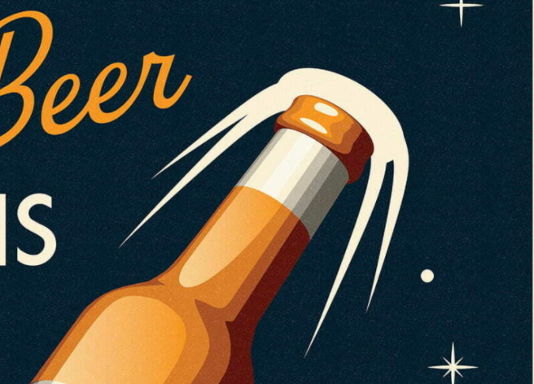

# Loumans; a simple first try at Hugo theming. 

The mood of Loumans is inspired on Veerle Duoh's [vintage beer poster](https://veerle.duoh.com/inspiration/big-smoke-brewery-x). This dictated the base color scheme for the site:



It is originally a fork of Pickles; a gorgeous simple theme which can be obtained [here](https://github.com/mismith0227/hugo_theme_pickles).

## Overview

- Modern, Simple and beautiful design
- Social links（Twitter,Facebook,Instagram,Google+,GitHub,GitLab,npm,Codepen,Dribbble,500px,Flickr,Pinterest,Tumblr,Vimeo,YouTube,Linkedin）
- Support for Related Content
- Support for tags
- Analytics with Google Analytics
- Responsive design
- SVG Sprite


## Features

- Sass
- SVG Sprite
- Standard

## Installation

In your hugo site directory, run:

```shell
$ git submodule add https://github.com/moonwitch/hugo-theme-loumans .themes/
```

## Usage

Use hugo's -t hugo-theme-loumans or --theme=-theme-loumans option with hugo commands. 
Example:

```shell
$ hugo server -t -theme-loumans -w -D
```

## License

Open sourced under the MIT license.
